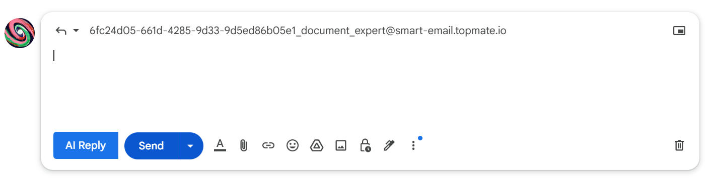
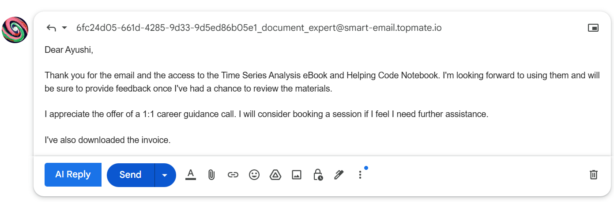
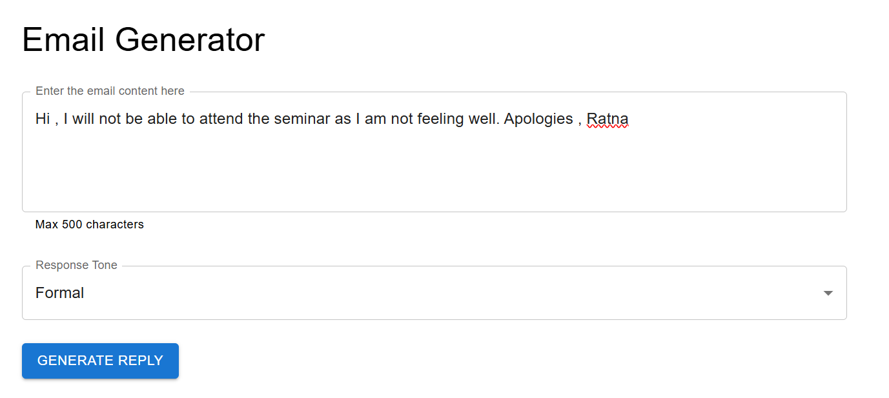
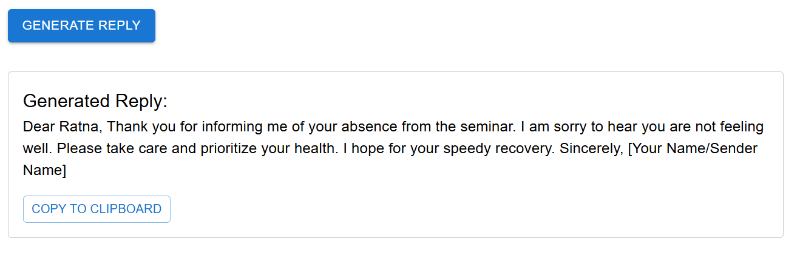

# 📧 Smart Email Assistant

An AI-powered solution that enhances email productivity by generating intelligent, context-aware replies using Spring Boot, SpringAI, and Gemini. This project includes a full-stack web application and a browser extension for seamless Gmail integration.

---

## 🚀 Features

- ✉️ **AI-Generated Replies** using Spring Boot and Gemini API
- 🧠 **Context-Aware Responses** tailored to the received email
- 🖥️ **Full-Stack Implementation** with React frontend and Spring Boot backend
- 🌐 **Browser Extension Support** for native integration with Gmail
- ⚙️ **Modular Architecture** for scalability and maintainability

### 🖼️ AI Reply to your emails in lightning speed

<p align="center">
  
</p>

<p align="center">
  
</p>

---

### 🖥️ Access frontend for additional feature: Tone

<p align="center">
  
</p>

<p align="center">
  
</p>

---

## 🛠️ Tech Stack

| Layer       | Technology        |
|-------------|-------------------|
| Backend     | Java, Spring Boot |
| Frontend    | React.js          |
| Extension   | JavaScript        |
| AI API      | Google Gemini     |
| Build Tools | Maven, npm , Vite |


## ✅ Prerequisites

- Java 17+
- Node.js & npm
- Maven
- Chrome browser

---

## 🧑‍💻 Setup


```bash
Backend Setup
cd email-writer-sb
mvn clean install
mvn spring-boot:run
The backend will run on http://localhost:8080.

🎨 Frontend Setup
bash
Copy
Edit
cd email-writer-react
npm install
npm start
The frontend will run on http://localhost:3000.

🧩 Chrome Extension Setup
Open Chrome and go to chrome://extensions/

Enable Developer Mode

Click Load Unpacked

Select the email-writer-ext folder

Open Gmail — the "AI Reply" button will appear when composing an email

💻 Usage
React App: Paste or type an email into the UI and click "Generate Reply" to get a response from the AI.

Chrome Extension: In Gmail, click the "AI Reply" button while composing a reply. The assistant will analyze the context and generate a response instantly.

📸 Screenshots
(Add screenshots here if available)

🤝 Contributing
Contributions are welcome!

bash
Copy
Edit
# Fork the repository
# Create your feature branch
git checkout -b feature-name

# Make changes and commit
git commit -m "Add some feature"

# Push to GitHub
git push origin feature-name

# Open a pull request
📄 License
This project is licensed under the MIT License. See the LICENSE file for more details.

🙏 Acknowledgements
Spring Boot

SpringAI

Google Gemini API

React.js

Chrome Extension Docs

📚 References
This project was inspired by and adapted from the amazing work by the EmbarkX community:

🔗 EmbarkXOfficial/spring-ai-masters – Email Writer Module

Special thanks to them for open-sourcing the foundational code structure and ideas!

✨ Author
Dev Vyas — @Dev-yas on GitHub

Built with ❤️ to make emails smarter and life easier.
